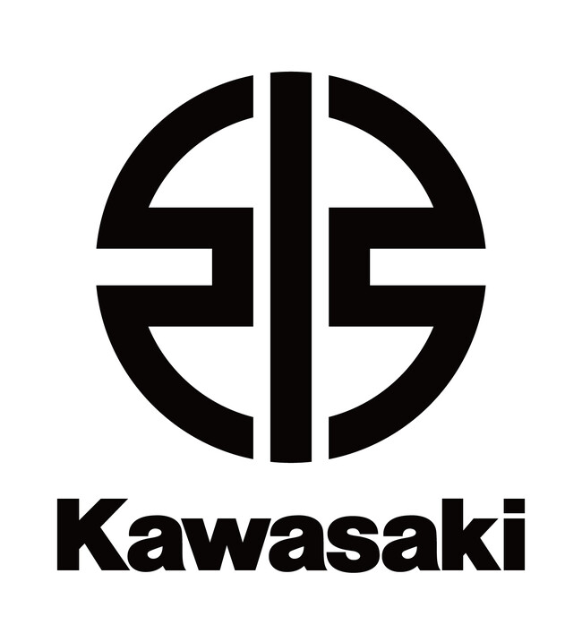

# Kawasaki Heavy Industries

Bienvenido a esta página dedicada a **Kawasaki**, una de las marcas de motocicletas más importantes del mundo.  
Aquí encontrarás información sobre su historia, su fundador y sus modelos más famosos.

---

## ¿Qué es Kawasaki?
Kawasaki Heavy Industries, Ltd. es una empresa japonesa fundada en el siglo XIX que fabrica desde trenes y aviones hasta barcos, maquinaria pesada y **motocicletas**.  
La división de motos, conocida como **Kawasaki Motors**, se ha convertido en una de las más influyentes en la historia del motociclismo.

---

## Orígenes de la empresa
- **Fundador:** Shozo Kawasaki  
- **Año de creación:** 1878  
- **Lugar:** Tokio, Japón  

Shozo Kawasaki comenzó con una empresa naviera que más tarde evolucionó en un **gigante industrial japonés**.  
Su visión de fabricar productos duraderos y de calidad marcó el futuro de la compañía.

---

## Índice de contenido
- [Biografía de Shozo Kawasaki](./biografia.md)
- [Modelos estrella de Kawasaki](./biografia.md#modelos-estrella)
- [Página oficial de Kawasaki](https://www.kawasaki.com/)

---

**Palabras clave importantes:**  
- **Innovación**  
- **Potencia**  
- **Competición**  

Gracias a estas tres características, Kawasaki ha logrado mantenerse en la cima del motociclismo mundial.
